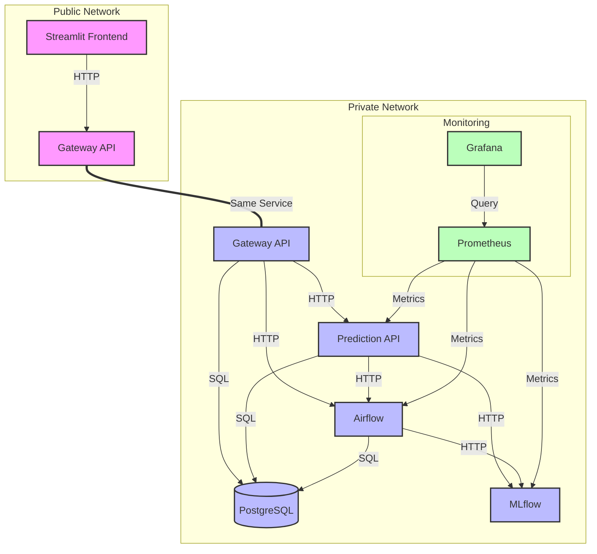
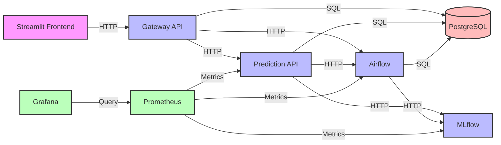

# Architecture

## Capacity 

Our standard methodology has involved several key steps: 
- data collection
- data loading and preprocessing (normalization, transformation)
- model creation
- model training
- model prediction and evaluation
- model deployment. 

## Architecture layers

### Business

### Applicative

Basic scheme of the application :

Version 1 :

Version 2 (Service-focused):

### Technologique

