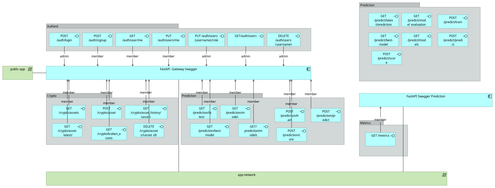

# Architecture


## Capacity 


## Architecture layers

### Business


### Applicative

#### Streamlit

Streamlit is our frontend application. It's the only service available only on the public network. It shares the public network with the gateway API which is used to access the private services securely. It's exposed on the port 8501.

##### Structure

```
RepoCrypto/frontend/
├── Dockerfile              # Streamlit container configuration
├── app.py                  # Streamlit entry point
├── requirements.txt        # Python dependencies
├── utils/
│   ├── __init__.py
│   ├── api_client.py      # API client functions
│   └── auth.py            # authentification functions
└── pages/
    ├── __init__.py
    ├── account.py         # manage his account
    ├── administration.py  # manage user accounts
    ├── create_user.py     # create a new user
    ├── data_analysis.py   # data analysis of historical data
    ├── home.py            # home page
    ├── model.py           # model management
    └── predictions.py     # predictions visualization
```

Some pages are only accessible for admin users, such as administration.py and create_user. Other pages are accessible for all users. The frontend use the role and the token to manage the access to the pages.
The only service with which the frontend communicate is the gateway API. It's throught the API that the frontend can access authentification / authorization services and backend features.
In streamlit we used plotly to create the charts and display the data.

Below is the scheme of Streamlit features through the API Gateway endpoints


#### API

in our project, we decided to have 2 FastAPI applications, one is only on a private network for security reasons and the other one is on both private and public networks to work as a bridge between the frontend (streamlit), the private API and other services.

Please see below an illustration of our API architecture




##### Private API

The goal of our private API is to communicates with airflow to trigger training and prediction tasks.

###### Structure
```
PredictionAPI/
├── app/
│   ├── __init__.py
│   ├── main.py          # FastAPI application entry point
│   ├── registry.py      # Prometheus metrics configuration
│   └── prediction/
│       ├── __init__.py
│       └── router.py    # Prediction endpoints and logic
├── Dockerfile          # Container configuration
├── gunicorn_conf.py   # Gunicorn server settings
├── start-reload.sh 
├── start.sh 
└── requirements.txt   # Python dependencies
```

The Dockerfile configures the containerized environment for the Prediction API. It is used by the docker-compose file to start this service. It exposes port 3001, uses gunicorn_conf.py to configure the gunicorn server and requirements.txt to install the dependencies. The dockerfile is configured to use the start-reload.sh script to start the service in development mode (enabling hot reloading) and the start.sh script to start the service in production mode.
Gunicorn_conf.py configures the Gunicorn WSGI server that runs the FastAPI application. It manages the number of workers, timeout, and other settings.
main.py is the entry point of the FastAPI application. It initializes the application and sets up the necessary configurations. It sets up CORS middleware, implements rate limiting, configures Prometheus metrics middleware and registers routers.
As we have FastAPI running with multiple Gunicorn workers, the request is load balanced across the workers. It also meands that registry is crucial for prometheus metrics to be scraped properly. Registry.py is used to configure the prometheus metrics which are  used in the main.py and router.py files.
Router.py defines the routes and the logic behind them.

###### Endpoints

How requests are handled:
```
graph LR
    A[Client Request] --> B[Docker Container]
    B --> C[Gunicorn]
    C --> D[FastAPI App]
    D --> E[Route Handlers]
```

we have several endpoints:

* GET /metrics
    * Response: Prometheus metrics in text format
    * This endpoint provides monitoring metrics including:
        * prediction_api_request_count: Total requests
        * prediction_api_request_latency_seconds: Request timing
        * prediction_api_exception_count: Error tracking
        * prediction_api_prediction_count: Prediction usage
        * prediction_api_model_score: Model performance

* GET /predict/latest-prediction
    * Response: JSON object containing the latest prediction
    * It uses the prediction saved in the database to avoid calling the model unnecessarily.

* GET /predict/model-evaluation
    * Response: JSON object containing the model evaluation (MSE (train/test) and R² score (train/test))
    * It uses the evaluation saved in the database to avoid calling the model unnecessarily.

* GET /predict/models
    * Response: JSON object containing the list of available models
    * It uses MLflow client to get the list of models.

* GET /predict/best-model
    * Response: JSON object containing the best model
    * It uses the best models in the database to return the best model based on the MSE.

* POST /predict/train
* POST /predict/score
* POST /predict/predict
    * These endpoints are used to trigger the training, scoring and prediction tasks in airflow.

The endpoints works with:
* PostgreSQL database
* MLflow
* Airflow
* Prometheus

##### Gateway API

The goal of our gateway API is to work as a bridge between the frontend and the private API and other services for security reasons.

###### Structure
```
PredictionAPI/
├── app/
│   ├── __init__.py
│   ├── main.py          # FastAPI application entry point
│   ├── database.py      # Database configuration
│   └── authentication/
│       ├── __init__.py
│       ├── security.py  # Token generation and verification functions
│       ├── utils.py     # Password hashing and verification functions
│       └── router.py    # Authentication endpoints and logic
│   └── crypto/
│       ├── __init__.py
│       └──  router.py    # Crypto endpoints and logic
│   └── prediction/
│       ├── __init__.py
│       └── router.py    # Prediction endpoints and logic
├── Dockerfile          # Container configuration
├── gunicorn_conf.py   # Gunicorn server settings
├── start-reload.sh 
├── start.sh 
└── requirements.txt   # Python dependencies
```

The architecture is quite similar to the private API but it has some differences. It includes authentication and authorization mechanisms based on user roles, passwords and tokens. These enables us to protect sensitive and critical points.
The crypto folder includes the endpoints to get the list of available cryptocurrencies, add new cryptocurrencies based on what's available in Kraken (our dataprovider) delete cryptocurrencies, get current prices or historical data.
The prediction folder just had endpoints querying the private API to get the predictions, models, trigger training, scoring and prediction tasks...

###### Endpoints

The list of all endpoints:

* POST /auth/signup 
* POST /auth/login (not protected)
* GET /auth/users/me
* PUT /auth/users/me
* DELETE /auth/users/{username}
* PUT /auth/users/{username}/role
* GET /auth/users
* GET /crypto/assets
* POST /crypto/assets
* GET /crypto/asset_history/{asset}
* DELETE /crypto/assets/{asset_id}
* GET /crypto/kraken_assets
* GET /crypto/asset_latest/{asset}
* GET /prediction/latest-prediction
* GET /prediction/model-evaluation
* GET /prediction/best-model
* GET /prediction/models
* POST /prediction/train
* POST /prediction/score
* POST /prediction/predict

The endpoints works with:
* Private API
* PostgreSQL database
* Airflow

### Technologique

