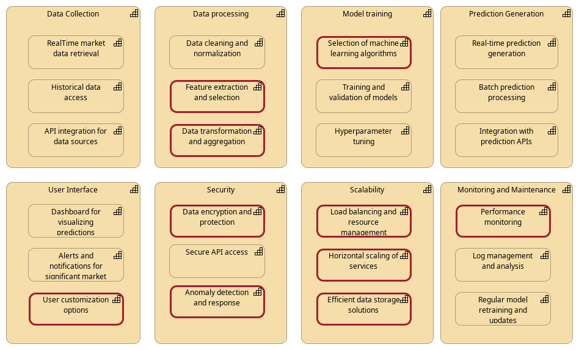
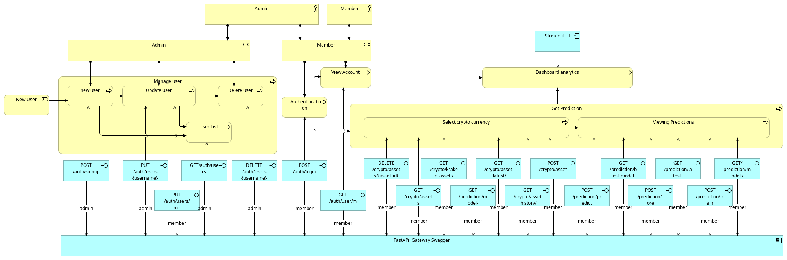
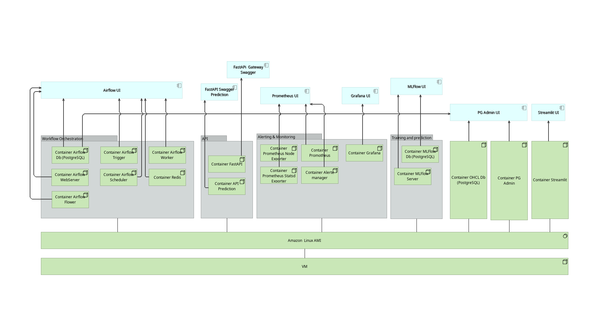

# Architecture


## Capability

This diagram provides a structured view of the capabilities and sub-capabilities involved in a cryptocurrency prediction application, or at least how we imagine it !

???+ Info

    All sub capabilities surrounded by red line are note implemented in ths Proof Of Concept (POC).




### Data Collection

This capability involves gathering data from various sources, which is essential for making accurate predictions.

#### Sub-capabilities

* _**Real-time Market Data Retrieval:**_ Continuously collecting current price, volume, and other relevant market data from exchanges and financial platforms.

* _**Historical Data Access:**_ Accessing past market data to identify patterns and trends over time.

* _**API Integration for Data Sources:**_ Connecting with external APIs to fetch data from different exchanges, news platforms, social media, and more.

### Data Processing

Once data is collected, it needs to be processed to make it suitable for analysis and model training.

#### Sub-capabilities

* _**Data Cleaning and Normalization:**_ Removing noise and inconsistencies in the data, and normalizing it to a standard format.

* _**Feature Extraction and Selection:**_ Identifying and selecting the most relevant features that will be used in model training.

* _**Data Transformation and Aggregation:**_ Transforming data into a structured format and aggregating it to make it suitable for analysis.

### Model Training

Training predictive models using the processed data to forecast future cryptocurrency prices and trends.

#### Sub-capabilities

* _**Selection of Machine Learning Algorithms:**_ Choosing the appropriate machine learning algorithms for prediction (e.g., LSTM, Random Forest, SVM).

* _**Training and Validation of Models:**_ Training the models using historical data and validating their performance using a validation set.

* _**Hyperparameter Tuning:** Adjusting the model parameters to optimize performance.

### Prediction Generation

Generating predictions based on the trained models.

#### Sub-capabilities:

* _**Real-time Prediction Generation:**_ Producing predictions in real-time based on current market data.

* _**Batch Prediction Processing:**_ Running predictions in batches for historical analysis or reporting.

* _**Integration with Prediction APIs:**_ Exposing prediction functionalities through APIs for other applications to consume.

### User Interface

Providing an interface for users to interact with the application, view predictions, and customize their experience.

#### Sub-capabilities

* _**Dashboard for Visualizing Predictions:**_ Creating interactive dashboards to display predictions, trends, and insights.

* _**Alerts and Notifications:**_ Sending real-time alerts and notifications for significant market movements.

* _**User Customization Options:**_ Allowing users to customize their dashboards and set preferences for alerts and notifications.


### Security

Ensuring that the application and data are secure from unauthorized access and breaches.

#### Sub-capabilities

* _**Data Encryption and Protection:**_ Encrypting data at rest and in transit to protect it from unauthorized access.

* _**Secure API Access:**_ Implementing security measures like API keys and authentication to secure API endpoints.

* _**Anomaly Detection and Response:**_ Detecting and responding to anomalies in data access and usage.


### Scalability

Ensuring that the application can handle increased loads and grow as needed.

#### Sub-capabilities

* _**Load Balancing and Resource Management:**_ Distributing workload across multiple servers to ensure optimal performance.

* _**Horizontal Scaling of Services:**_ Adding more instances of services to handle increased demand.

* _**Efficient Data Storage Solutions:**_ Implementing scalable and efficient storage solutions to manage large volumes of data.

### Monitoring and Maintenance

Regularly monitoring and maintaining the application to ensure it runs smoothly.

#### Sub-capabilities

* _**Performance Monitoring:**_ Continuously monitoring the performance of the application and its components.

* _**Log Management and Analysis:**_ Collecting and analyzing logs to identify and troubleshoot issues.

* _**Regular Model Retraining and Updates:**_ Regularly updating the models with new data to ensure their accuracy and relevance.


## Architecture layers

### Business (user process)

The user journey refers to the sequence of steps a user takes to interact with our application. In the context of a cryptocurrency prediction application with a FastAPI front end, the user journey can be broken down into several stages. 



### Applicative

This diagram illustrate all apps used in our application.


### Technology

When choosing infrastructure containers for a cryptocurrency prediction project, several factors come into play to ensure scalability, reliability, and efficiency. 

This project can be view a a POC and we did not use Orchestration with Kubernetes, we used Docker and Docker-Compose on a single VM.

This schema illustrate the containerized structure of the application.




#### Streamlit

Streamlit is our frontend application. It's the only service available only on the public network. It shares the public network with the gateway API which is used to access the private services securely. It's exposed on the port 8501.

##### Structure

```
RepoCrypto/frontend/
├── Dockerfile              # Streamlit container configuration
├── app.py                  # Streamlit entry point
├── requirements.txt        # Python dependencies
├── utils/
│   ├── __init__.py
│   ├── api_client.py      # API client functions
│   └── auth.py            # authentification functions
└── pages/
    ├── __init__.py
    ├── account.py         # manage his account
    ├── administration.py  # manage user accounts
    ├── create_user.py     # create a new user
    ├── data_analysis.py   # data analysis of historical data
    ├── home.py            # home page
    ├── model.py           # model management
    └── predictions.py     # predictions visualization
```

Some pages are only accessible for admin users, such as administration.py and create_user. Other pages are accessible for all users. 

The frontend use the role and the token to manage the access to the pages.

The only service with which the frontend communicate is the gateway API. It's throught the API that the frontend can access authentification / authorization services and backend features.

In streamlit we used plotly to create the charts and display the data.

Below is the scheme of Streamlit features through the API Gateway endpoints


#### API management

in our project, we decided to have 2 FastAPI applications, one is only on a private network for security reasons and the other one is on both private and public networks to work as a bridge between the frontend (streamlit), the private API and other services.

Please see below an illustration of our API architecture


* Private API : The goal of our private API is to communicates with airflow to trigger training and prediction tasks.

##### Prediction API
```
PredictionAPI/
├── app/
│   ├── __init__.py
│   ├── main.py          # FastAPI application entry point
│   ├── registry.py      # Prometheus metrics configuration
│   └── prediction/
│       ├── __init__.py
│       └── router.py    # Prediction endpoints and logic
├── Dockerfile          # Container configuration
├── gunicorn_conf.py   # Gunicorn server settings
├── start-reload.sh 
├── start.sh 
└── requirements.txt   # Python dependencies
```

The Dockerfile configures the containerized environment for the Prediction API. 
* It is used by the docker-compose file to start this service. 

* It exposes port 3001, uses gunicorn_conf.py to configure the gunicorn server and requirements.txt to install the dependencies. 

The dockerfile is configured to use the start-reload.sh script to start the service in development mode (enabling hot reloading) and the start.sh script to start the service in production mode.

Gunicorn_conf.py configures the Gunicorn WSGI server that runs the FastAPI application. It manages the number of workers, timeout, and other settings.

main.py is the entry point of the FastAPI application. It initializes the application and sets up the necessary configurations. It sets up CORS middleware, implements rate limiting, configures Prometheus metrics middleware and registers routers.

As we have FastAPI running with multiple Gunicorn workers, the request is load balanced across the workers. It also meands that registry is crucial for prometheus metrics to be scraped properly. 

Registry.py is used to configure the prometheus metrics which are  used in the main.py and router.py files.
Router.py defines the routes and the logic behind them.

###### Endpoints

How requests are handled:
```
graph LR
    A[Client Request] --> B[Docker Container]
    B --> C[Gunicorn]
    C --> D[FastAPI App]
    D --> E[Route Handlers]
```

we have several endpoints:

* _**GET /metrics**_
    * Response: Prometheus metrics in text format
    * This endpoint provides monitoring metrics including:
        * prediction_api_request_count: Total requests
        * prediction_api_request_latency_seconds: Request timing
        * prediction_api_exception_count: Error tracking
        * prediction_api_prediction_count: Prediction usage
        * prediction_api_model_score: Model performance

* _**GET /predict/latest-prediction**_
    * Response: JSON object containing the latest prediction
    * It uses the prediction saved in the database to avoid calling the model unnecessarily.

* _**GET /predict/model-evaluation**_
    * Response: JSON object containing the model evaluation (MSE (train/test) and R² score (train/test))
    * It uses the evaluation saved in the database to avoid calling the model unnecessarily.

* _**GET /predict/models**_
    * Response: JSON object containing the list of available models
    * It uses MLflow client to get the list of models.

* _**GET /predict/best-model**_
    * Response: JSON object containing the best model
    * It uses the best models in the database to return the best model based on the MSE.

* _**POST /predict/train**_
* _**POST /predict/score**_
* _**POST /predict/predict**_
    * These endpoints are used to trigger the training, scoring and prediction tasks in airflow.

The endpoints works with:
* PostgreSQL database
* MLflow
* Airflow
* Prometheus

##### Gateway API

The goal of our gateway API is to work as a bridge between the frontend and the private API and other services for security reasons.

###### Structure
```
PredictionAPI/
├── app/
│   ├── __init__.py
│   ├── main.py          # FastAPI application entry point
│   ├── database.py      # Database configuration
│   └── authentication/
│       ├── __init__.py
│       ├── security.py  # Token generation and verification functions
│       ├── utils.py     # Password hashing and verification functions
│       └── router.py    # Authentication endpoints and logic
│   └── crypto/
│       ├── __init__.py
│       └──  router.py    # Crypto endpoints and logic
│   └── prediction/
│       ├── __init__.py
│       └── router.py    # Prediction endpoints and logic
├── Dockerfile          # Container configuration
├── gunicorn_conf.py   # Gunicorn server settings
├── start-reload.sh 
├── start.sh 
└── requirements.txt   # Python dependencies
```

The architecture is quite similar to the private API but it has some differences. It includes authentication and authorization mechanisms based on user roles, passwords and tokens. These enables us to protect sensitive and critical points.

The crypto folder includes the endpoints to get the list of available cryptocurrencies, add new cryptocurrencies based on what's available in Kraken (our dataprovider) delete cryptocurrencies, get current prices or historical data.
The prediction folder just had endpoints querying the private API to get the predictions, models, trigger training, scoring and prediction tasks...

###### Endpoints

The list of all endpoints:

* _**POST /auth/signup**_ : Record new user
* _**POST /auth/login (not protected)**_ : User loggin
* _**GET /auth/users/me**_ : Modify user information profil by user
* _**PUT /auth/user/me**_ : Check user account for user
* _**DELETE /auth/users/{username}**_ : Delete users by admin
* _**PUT /auth/users/{username}/role**_ : Modify user role by admin
* _**GET /auth/users**_ : Get users list by admin
* _**GET /crypto/assets**_ : Get all assets in db
* _**POST /crypto/assets**_ : Add new asset
* _**GET /crypto/asset_history/{asset}**_ : Get asset OHLC value history to date 
* _**DELETE /crypto/assets/{asset_id}**_ : Get asset OHLC value history to date 
* _**GET /crypto/kraken_assets**_ : Get list of assets from provider
* _**GET /crypto/asset_latest/{asset}**_ : Get last OHCL value from Db
* _**GET /prediction/latest-prediction**_ : Get last prediction for asset (BTC)
* _**GET /prediction/model-evaluation**_ : Get last model evalution for asset (BTC)
* _**GET /prediction/best-model**_ : Get prediction of best model for asset (BTC)
* _**GET /prediction/models**_ : List all model experiments
* _**POST /prediction/train**_ : Trigger Airflow DAG training
* _**POST /prediction/score**_ : Trigger Airflow DAG scoring
* _**POST /prediction/predict**_ : Trigger Airflow DAG prediction

The endpoints works with:
* Private API
* PostgreSQL database
* Airflow

