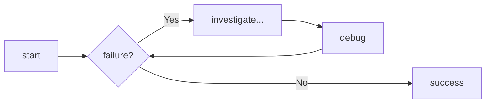

## content tab

### generic

=== "plain"

    blablz

=== " plan2"

    * first item
    * second item

=== "order"

    1. item
    2. item

    !!! note "ttt"

        aaaaaaa

    ??? tip "ttt"

        aaaaaaa

