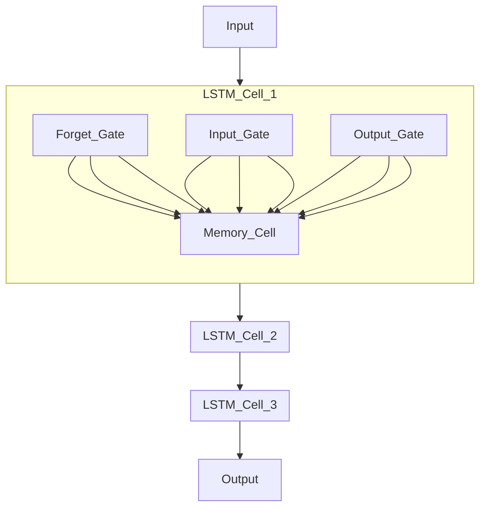

# Modeling

## Introduction

### Bitcoin

Bitcoin is an electronic currency introduced in 2008 by [Nakamoto](https://bitcoin.org/bitcoin.pdf). It was made possible by blockchain technology and allows for secure peer-to-peer transactions using cryptography.

Today, bitcoin (BTC) is the most important and widely used cryptocurrency. It is used in many financial and commercial activities.

Predicting the prices of cryptocurrencies is crucial for investors and academics in this field due to the frequent volatility of the price of this currency.

Predicting the price of cryptocurrencies is a time series prediction problem. The time step chosen for the project is a **one-day interval for short-term prediction of the price**.

## financial cryptocurrency market

The financial cryptocurrency market, similar to traditional stock exchanges, operates through the buying and selling of digital assets. 

Unlike stock exchanges where assets are shares in companies, cryptocurrencies are digital tokens that utilize blockchain technology. 

Bitcoin, the first and most well-known cryptocurrency, has unique characteristics such as high volatility and 24/7 trading availability. 

Predicting Bitcoin prices is crucial for financial strategy and profitability as it helps investors make informed decisions. 

### Price prediction of cryptocurrencies

In the literature on time series prediction, Machine Learning (ML) algorithms have been widely used. Due to the extreme volatility and lack of seasonality in the Bitcoin market, linear price prediction methods have proven to be unsuccessful.

Scientific studies have shown that Deep Learning models (Recurrent Neural Networks (RNN), Gradient Boosting Classifiers (GBC)) are particularly well-suited for short-term prediction of the Bitcoin market behavior, and that input technical variables such as past price, the evolution of Bitcoin returns over time, and characteristics of its blockchain (such as the number of BTC transactions) have the most significant impact on short-term prediction.

Other predictive variables such as the price of the MSCI World index, the S&P 500, the Nasdaq, the price of gold or a barrel of oil can also be used.

Several studies have concluded that the LSTM model is the most performant in terms of prediction with metrics such as Root Mean Squared Error (RMSE), Mean Absolute Error (MAE), Mean Squared Error (MSE), and R-squared score (R2)
([exemple](https://thesai.org/Downloads/Volume14No8/Paper_37-Prediction_of_Cryptocurrency_Price_using_Time_Series_Data.pdf))

Other studies have introduced sentiment variables of its community through sentiment analysis (identification and classification of sentiments expressed in a natural language text.Philippas et al.(2019), using tools such as VADER or TextBlob, or machine learning models to analyze the sentiment of tweets) supporting the idea that the price of Bitcoin is determined by the sentiment of the Bitcoin community on social networks. These variables seem to gain importance for the medium and long-term prediction of Bitcoin. [Philippas et al.(2019)](https://www.sciencedirect.com/science/article/abs/pii/S1544612319300558)

Sources such as Twitter (**API Twitter**: tweets containing relevant keywords such as "Bitcoin", "BTC", "crypto", etc.) or Google Trends (**Google Trend API**) have been used (search trends as an indicator of community interest and engagement).

### Model and Predictive Variables

The model considered for this project is a Long Short-Term Memory (LSTM) recurrent neural network. The predictive variable used will be the past price of Bitcoin (daily closing price), which may be optionally associated with other technical variables such as transaction volume.
The temporality and objective of the project are such that sentiment analysis and trend analysis will not be implemented, especially since it is a one-day prediction and that it is not the aim of this MLops project.


## Methodology

### Introduction

Our standard methodology involves several key steps: 
- data collection
- data loading and preprocessing
- model creation
- model training
- model prediction and evaluation
- model deployment. 

The data is then preprocessed, normalized, and split into training and test sets.
An LSTM model is developed, trained, and evaluated using MLflow for tracking and versioning. 
The final model is deployed via FastAPI, with Prometheus and Grafana for monitoring and logging. Streamlit is used to create a user-friendly dashboard for visualizing predictions.

#### Structure
```
Main Repo/
├── src/
│   ├── __init__.py│   
│   ├── data/
│   │   ├── __init__.py│
│   │   ├── database.py  # crypto Database Connection
│   │   ├── import_raw_data.py  # Loading data
│   │   ├── make_dataset.py  # Construction of appropriate Dataset for LSTM model
│   ├── evaluation/
│   │   ├── __init__.py│
│   │   ├── evaluate.py  # Scaling and score modules
│   │   ├── ml_flow.py  # modules to initiate, get, lmoad experiments and models in mlflow
│   ├── features/
│   │   ├── __init__.py│
│   │   ├── preprocess.py  # Normalization of Data
│   ├── models/
│   │   ├── __init__.py│
│   │   ├── modelLSTM.py  # CLass LSTM for modelling
│   │   ├── train_model M.py  # Callbacks and train module
├── scripts/
│   ├── __init__.py│
│   ├── train2.py    # Main Training script
│   ├── predict2.py   # Main predicting script
│   ├── evaluate_model2.py # Main evaluation script│
│   ├── Dockerfile  # Docker configuration file for modelling (airflow worker)

## Flow and sequencing overview

### Data loading and transforming

We used Airflow to automate data collection from a postgres SQL Database named (data_db) filled with data from Data provider Kraken,   throught Python module *import_raw_data*
First, useless columns from the ohlv table in data_db are removed through function *normalize_data2*
Then numerical features are beeing normalized to ensure that all features contribute equally to the model training process. Technique Min-Max scaling was used.

We used Airflow to download full historical data for each cryptocurrency pair which is essential to capture all relevant patterns. Hourly or daily automated data retrieval ensures the dataset is up-to-date and comprehensive, depending on the prediction step chosen.
One day was chosen for the project, but it would be possible to use the project with one minute, one hour, one week predicion interval.

### Predictive variable

#### Mechanism of cryptocurrency pricing 

The mechanism of cryptocurrency pricing is driven by market demand and supply dynamics, influenced by factors such as market sentiment, economic news, and regulatory developments. Data can be formatted using the Open-High-Low-Close (OHLC) standard, which captures key price points for each time interval. Below is an example of how to retrieve data using Python from Kaggle:

```python
print('hello world')
```
#### Decision
We decided to retain only the cryptocurrency past price to predict cryptocurrency future price.
This choice has been made taking incto account the short term prediction chosen (1 day) and conclusions of several scientific bibliography on the topic.

### Building dataset for training and testing

Transformed time-series data was splited into 2 datasets with 70% training data and 30% testing data.
Then Sequencing of time series was made using two differents periods of time for training dataset and testing dataset.
Two sequences was built (X and y) through Python module *make_dataset*:
- X is a sequence of prices of size *pas_temps* (parameter representing the number of past days which are used directly for prediction)
- y is the next value, which will be the value to predict.

Parameter *pas_temps* is an important parameter of the model. This paramater has been finally fixed to 14 days and not used as a parameter in order to reduce training time and model complexity.This value has been chosen after optimization tests. 

### Modelling

#### Model selection
A simple LSTM model was chosen taking into account scientific publications and its good performance in time series crypty prediction.

Long Short-Term Memory (LSTM) networks are a type of recurrent neural network (RNN) designed to capture long-term dependencies in sequential data. LSTMs use memory cells to maintain information over time, which helps in learning time-series patterns more effectively. 

Below is a LaTeX representation of an LSTM cell:

##### LSTM Model Architecture
_[explain with mermaid diagram the whole LTSM architecture in detail with explaination]_

this graph must be 're modeling' ! 


The architecture consists of multiple LSTM cells that process input sequentially, allowing the model to learn temporal dependencies.

#### Model creation and instanciation

A custom Class LSTMModel is created to instanciate the model, with the following parameters :
    -neurons: number of neurons in the network;
    -loss function used during training: mean squarred error ('mse')
    -metrics: 'mse' metrics, used in mlflow used to differentiate models performance.
    -optimizer used during compiling: 'adam'
    -activation function: "relu"

An LSTM like Model was created using a Sequential object, composed of an input layer (default size (None,1)), an LSTM layer and a Dense layer with 1 neuron for prediction.
LSTM Class is composed of following built-in methods : __init__, fit, predict, save_model, load_model, get_params, set_params and __str__

### Model Training

#### MLflow

Model training has been realized with MLflow.

MLflow is an open-source platform for managing the end-to-end machine learning lifecycle. It was developed by Databricks to address the complexities of model tracking, versioning, and deployment. MLflow works by logging metrics, parameters, and artifacts during training. These logs can then be used to compare different runs and select the best model for deployment.

#### Practical implementation

The model has been  trained with training dataset.

Callbacks early_stopping and reduce_learning_rate were used during training to make it more efficient.
An mlflow run is created for each parameter tested (pas_temps and batch_size), then model score and parameters are logged into mlflow tracking Server.
Finaly, the model with best mse is chosen and logged into mlflow throught *tensorflow.log_model* method.

A number of neuron equal to 350 has been fixed after optimization tests, with a compromise between duration of the training and performance.

Bacth size was used as the main parameter to vary during the training.

### Prediction and evaluation
This step loads data, normalizes and create a test dataset in order to predict the next price of Bitcoin 
Then the best model thought is loaded through mlflow module *tensorflow.load_model* in order to make predictions.
The script returns the predicted value as a dictionary.
For each prediction, it records prediction metrics and the score (mse score on test dataset) and compares them to a reference for mse (fixed to a value of 100000, see Monitoring).

## Results and Discussion

Results have been globally satisfactory using only past bitcoin prices on a short term approach. Model has been volontary keep simple due to the fact that it was not the main purpose of the projet.

## tesaurus

_[list all terms used related to MLFLOW, LTSM, RNN ...with description. See frederic for more terms to explain]_

* **MLflow**: A platform for managing the end-to-end machine learning lifecycle.
* **LSTM**: Long Short-Term Memory, a type of recurrent neural network.
* **RNN**: Recurrent Neural Network, a class of neural networks for processing sequential data.
* **OHLC**: Open-High-Low-Close, a format for financial data.
* **MSE**: Mean Squared Error, a metric for evaluating model performance.
* **MAE**: Mean Absolute Error, a metric for evaluating model performance.
* **MAPE**: Mean Absolute Percentage Error, a metric for evaluating model performance.
* **FastAPI**: A web framework for building APIs with Python.
* **Prometheus**: An open-source monitoring and alerting toolkit.
* **Kibana**: An open-source analytics and visualization platform.
* **Streamlit**: An open-source app framework for Machine Learning and Data Science teams.

## References 
_[list related LTSM currency prediction usages, science paper, tests. And read/resume them !!]_

### Scientific references

1. Liu S, Liao G, Ding Y. Stock Transaction Prediction Modeling and Analysis Based on LSTM. In Proceedings of the 2018 13th IEEE Conference on Industrial Electronics and Applications (ICIEA), Wuhan,
China, 18–22 August 2018.
2. Borovkova S, Tsiamas I. An Ensemble of LSTM Neural Networks for High ‐ Frequency Stock Market Classification. Journal of Forecasting 2019; 38(6): 600–619.
3. Baek Y, Kim HY. ModAugNet: A New Forecasting Framework for Stock Market Index Value With an Overfitting Prevention LSTM Module and a Prediction LSTM Module. Expert Systems with Applications
2018; 113: 457–480
4. Eapen J, Bein D, Verma A. Novel Deep Learning Model With CNN and Bi-Directional LSTM for Improved Stock Market Index Prediction. In Proceedings of the 2019 IEEE 9th Annual Computing and
Communication Workshop and Conference (CCWC), Las Vegas, NV, USA, 7–9 January 2019.
5. Selvin S, Vinayakumar R, Gopalakrishnan EA, Menon VK, Soman KP. Stock Price Prediction Using LSTM, RNN and CNN-Sliding Window Model. In Proceedings of the 2017 International Conference on
Advances in Computing, Communications and Informatics (ICACCI), Udupi, India, 13–16 September 2017.
6. Nelson DM, Pereira AC, de Oliveira RA. Stock Market’S Price Movement Prediction With LSTM Neural Networks. In Proceedings of the 2017 International Joint Conference on Neural Networks (IJCNN),
Anchorage, AK, USA, 14–19 May 2017.
7. Sherstinsky A. Fundamentals of Recurrent Neural Network (RNN) and Long Short-Term Memory (LSTM) Network. Physica D: Nonlinear Phenomena 2020; 404: 132306.
8. Nabipour M, Nayyeri P, Jabani H, Mosavi A, Salwana E, Shahab S. Deep Learning for Stock Market Prediction. Entropy 2020; 22(8): 840.
9. Bhandari HN, Rimal B, Pokhrel NR, Rimal R, Dahal KR, Khatri RKC. Predicting Stock Market Index Using LSTM. Machine Learning with Applications 2020; 9: 100320.
10. Althelaya KA, El-Alfy E-SM, Mohammed S. Evaluation of Bidirectional LSTM for Short-and Long-Term Stock Market Prediction. In Proceedings of the 2018 9th International Conference on Information and Communication Systems (ICICS), Irbid, Jordan, 3–5 April 2018
11. Moghar A, Hamiche M. Stock Market Prediction Using LSTM Recurrent Neural Network. Procedia Computer Science 2020; 170: 1168–1173.
12. Burak Gülmez. Stock price prediction with optimized deep LSTM network with artificial rabbits optimization algorithm


## Similar project and scientific paper


[Lien n°1](https://github.com/Ali619/Bitcoin-Price-Prediction-LSTM/blob/master/Bitcoin_Price_Prediction.ipyn)
[Lien n°2](https://colab.research.google.com/drive/1wWvtA5RC6-is6J8W86wzK52Knr3N1Xbm#scrollTo=mU4B3eNtLpgH)
[Lien n°3](https://towardsdatascience.com/cryptocurrency-price-prediction-using-lstms-tensorflow-for-hackers-part-iii-264fcdbccd3f)
[Lien n°4](https://github.com/Marco75116/-Cryptocurrency_Price_Prediction/blob/main/LSTM.ipynb)
[Lien n°5](https://www.kaggle.com/code/meetnagadia/bitcoin-price-prediction-using-lstm)
[Lien n°6](https://thesai.org/Downloads/Volume14No8/Paper_37-Prediction_of_Cryptocurrency_Price_using_Time_Series_Data.pdf)
[Lien n°7](https://management-datascience.org/articles/20456/)
[Lien n°8](https://www.sciencedirect.com/science/article/pii/S2405918821000027)
[Lien n°9] https://www.sciencedirect.com/science/article/pii/S0957417423008485

