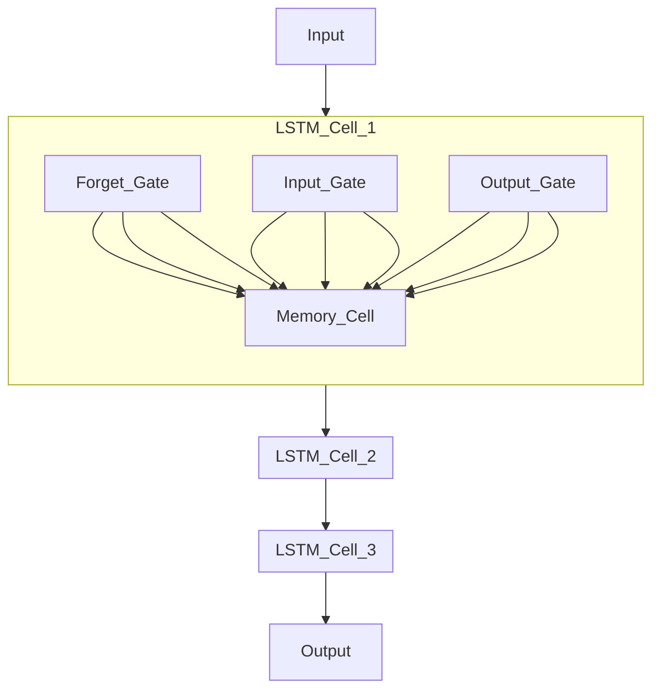

# Modeling
## Abstract
_[explain in general how financial cryptocurrency market work, specificities overs financial market as stock exchange. Focus on Bitcoin in particulary. Explain how prediction is important for financial strategy of profitability. Explain technics of timeseries prediction such MSE, MAE, MAPE... and the benefit of using deepl learning model such LTSM and list benefit and limitation of LTSM ]_

The financial cryptocurrency market, similar to traditional stock exchanges, operates through the buying and selling of digital assets. 

Unlike stock exchanges where assets are shares in companies, cryptocurrencies are digital tokens that utilize blockchain technology. 

Bitcoin, the first and most well-known cryptocurrency, has unique characteristics such as high volatility and 24/7 trading availability. 

Predicting Bitcoin prices is crucial for financial strategy and profitability as it helps investors make informed decisions. 
Time-series prediction techniques such as Mean Squared Error (MSE), Mean Absolute Error (MAE), and Mean Absolute Percentage Error (MAPE) are often used to evaluate model accuracy but Deep learning models like Long Short-Term Memory (LSTM) are particularly beneficial for their ability to capture long-term dependencies in time-series data. 

## Methodology

Our standard methodology involves several key steps: 
- data collection
- data loading and preprocessing
- model creation
- model training
- model prediction and evaluation
- model deployment. 

The data is then preprocessed, normalized, and split into training and test sets.

 An LSTM model is developed, trained, and evaluated using MLflow for tracking and versioning. 
The final model is deployed via FastAPI, with Prometheus and Kibana for monitoring and logging. Streamlit is used to create a user-friendly dashboard for visualizing predictions.

## Flow and sequencing overview
### Data loading and transforming
We used Airflow to automate data collection from a postgres SQL Database named (data_db) filled with data from Data provider kraken API, throught python module *import_raw_data*
First useless columns from the ohlv table in data_db are removed through function *normalize_data2*
Then numerical features has been normalized to ensure that all features contribute equally to the model training process. Techniques like Min-Max scaling are commonly used.

We used Airflow to ownloading the full historical data for each cryptocurrency pair is essential to capture all relevant patterns. Hourly or dayly tautomated data retrieval ensures the dataset is up-to-date and comprehensive, depending on the prediction setop (1 day was chosen, but it would be possible to use a minute, an hour, a week...)

### Predictive variable
#### mechanism of cryptocurrency pricing 
The mechanism of cryptocurrency pricing is driven by market demand and supply dynamics, influenced by factors such as market sentiment, economic news, and regulatory developments. Data can be formatted using the Open-High-Low-Close (OHLC) standard, which captures key price points for each time interval. Below is an example of how to retrieve data using Python from Kaggle:

```python
print('hello world')
```

#### Decision
We decided to retain only cryptocurrency past price to predict cryptocurrency future price.
This choice has been made taking incto account the short term prediction chosen (1 day) and conclusions of scientific bibliography on the topics.

### Building dataset for training and testing
Transformed time-series data is splited into 2 datasets with 70% training data and 30% testing data.
Then Sequencing of time series are made using the time series either for training dataset and testing dataset.
Two sequences are built (X and y) :
- X is a sequence of prices of size *pas_temps* (parameter representing the number of past days used directly for prediction)
- y is the next value, which will be the value to predict, through Python module *make_dataset*

Parameter *pas_temps* is an important parameter of the model. This paramater has been finally fixed to 14 days ant not used as a parameter in order to reduce training time and model complexity.
This value has been chosen after optimization tests. A number of neuros equalt to 350 has also been fixed, with a compromise between duration of teh training and performance. 

Bacth size was used as the main parameter to vary during tyje training.

### Modelling
#### Model selectio
An LSTM model was chosen taking into account scientific publications and its good performance in time series crypty prediction.

#### Model creation and instanciation
A custom Class LSTMModel is created to instanciate the model, with the following mains parameters :
    -neurons: nb of neurons in the network (int>0)
    -loss function used during training: mean squarred error ('mse')
    -metrics: 'mse' metrics, used in mlflow used to differentiate models performance.
    -optimizer used during compiling,: 'adam'
    -activation function, "relu"

LSTM like Model is created using a Sequential object and is composed of an input layer (default size (None,1)), an LSTM layer and a Dense layer with 1 neuron for prediction.
Class is composed of following built-in methods : __init__, fit, predict, save_model, load_model, get_params, set_params and __str__

#### LTSM Model 
Long Short-Term Memory (LSTM) networks are a type of recurrent neural network (RNN) designed to capture long-term dependencies in sequential data. LSTMs use memory cells to maintain information over time, which helps in learning time-series patterns more effectively. 

Below is a LaTeX representation of an LSTM cell:

##### LSTM Model Architecture
_[explain with mermaid diagram the whole LTSM architecture in detail with explaination]_

this graph must be 're modeling' ! 


The architecture consists of multiple LSTM cells that process input sequentially, allowing the model to learn temporal dependencies.

### Training step
#### MLflow
Model training has been dond using MLflow.
MLflow is an open-source platform for managing the end-to-end machine learning lifecycle. It was developed by Databricks to address the complexities of model tracking, versioning, and deployment. MLflow's benefits include simplified experiment tracking and reproducibility, although it may have limitations such as requiring additional setup and integration effort.
MLflow works by logging metrics, parameters, and artifacts during training. These logs can then be used to compare different runs and select the best model for deployment.
 MLflow is used to manage the machine learning lifecycle, including tracking experiments and deploying models.

#### Practical implementation
The model has benn then trained with training dataset.
Callbacks early_stopping and reduce_learning_rate were used during training tamke it more efficient.
An mlflow run is created for each parameter tested (pas_temps or batch_size), then model score and parameters are logged into mlflow tracking.
Finaly, the model with best mse is chosen with the mlflow tracking server and logged into mlflow throught *tensorflow.log_model* method.

### Prediction and evaluation Step
This step uses MLflow to track experiments and deploy models for predicting the price of Bitcoin 
It loads data, normalizes and creates a test dataset, then loads the best model thought mlflow module *tensorflow.load_model* in order to make predictions.
The script returns the predicted value as a dictionary
For each prediction, it records prediction metrics and the score (mse score on test dataset) and compares them to a reference (see Monitoring)

## Results and Discussion
Results have beeen satisfactory using only pastBTC prices for a short term approach. Model has been volontary keep simple due to the fact that it was not the main purposer of the projet.

## tesaurus

_[list all terms used related to MLFLOW, LTSM, RNN ...with description. See frederic for more terms to explain]_

* **MLflow**: A platform for managing the end-to-end machine learning lifecycle.
* **LSTM**: Long Short-Term Memory, a type of recurrent neural network.
* **RNN**: Recurrent Neural Network, a class of neural networks for processing sequential data.
* **OHLC**: Open-High-Low-Close, a format for financial data.
* **MSE**: Mean Squared Error, a metric for evaluating model performance.
* **MAE**: Mean Absolute Error, a metric for evaluating model performance.
* **MAPE**: Mean Absolute Percentage Error, a metric for evaluating model performance.
* **FastAPI**: A web framework for building APIs with Python.
* **Prometheus**: An open-source monitoring and alerting toolkit.
* **Kibana**: An open-source analytics and visualization platform.
* **Streamlit**: An open-source app framework for Machine Learning and Data Science teams.

## References 
_[list related LTSM currency prediction usages, science paper, tests. And read/resume them !!]_

1. Liu S, Liao G, Ding Y. Stock Transaction Prediction Modeling and Analysis Based on LSTM. In Proceedings of the 2018 13th IEEE Conference on Industrial Electronics and Applications (ICIEA), Wuhan,
China, 18–22 August 2018.
2. Borovkova S, Tsiamas I. An Ensemble of LSTM Neural Networks for High ‐ Frequency Stock Market Classification. Journal of Forecasting 2019; 38(6): 600–619.
3. Baek Y, Kim HY. ModAugNet: A New Forecasting Framework for Stock Market Index Value With an Overfitting Prevention LSTM Module and a Prediction LSTM Module. Expert Systems with Applications
2018; 113: 457–480
4. Eapen J, Bein D, Verma A. Novel Deep Learning Model With CNN and Bi-Directional LSTM for Improved Stock Market Index Prediction. In Proceedings of the 2019 IEEE 9th Annual Computing and
Communication Workshop and Conference (CCWC), Las Vegas, NV, USA, 7–9 January 2019.
5. Selvin S, Vinayakumar R, Gopalakrishnan EA, Menon VK, Soman KP. Stock Price Prediction Using LSTM, RNN and CNN-Sliding Window Model. In Proceedings of the 2017 International Conference on
Advances in Computing, Communications and Informatics (ICACCI), Udupi, India, 13–16 September 2017.
6. Nelson DM, Pereira AC, de Oliveira RA. Stock Market’S Price Movement Prediction With LSTM Neural Networks. In Proceedings of the 2017 International Joint Conference on Neural Networks (IJCNN),
Anchorage, AK, USA, 14–19 May 2017.
7. Sherstinsky A. Fundamentals of Recurrent Neural Network (RNN) and Long Short-Term Memory (LSTM) Network. Physica D: Nonlinear Phenomena 2020; 404: 132306.
8. Nabipour M, Nayyeri P, Jabani H, Mosavi A, Salwana E, Shahab S. Deep Learning for Stock Market Prediction. Entropy 2020; 22(8): 840.
9. Bhandari HN, Rimal B, Pokhrel NR, Rimal R, Dahal KR, Khatri RKC. Predicting Stock Market Index Using LSTM. Machine Learning with Applications 2020; 9: 100320.
10. Althelaya KA, El-Alfy E-SM, Mohammed S. Evaluation of Bidirectional LSTM for Short-and Long-Term Stock Market Prediction. In Proceedings of the 2018 9th International Conference on Information and Communication Systems (ICICS), Irbid, Jordan, 3–5 April 2018
11. Moghar A, Hamiche M. Stock Market Prediction Using LSTM Recurrent Neural Network. Procedia Computer Science 2020; 170: 1168–1173.


https://www.sciencedirect.com/science/article/pii/S0957417423008485
file:///home/misterneo/Downloads/9-2023+IAET-Conference-template-A4_Zhenglin+Li_H+(1).pdf