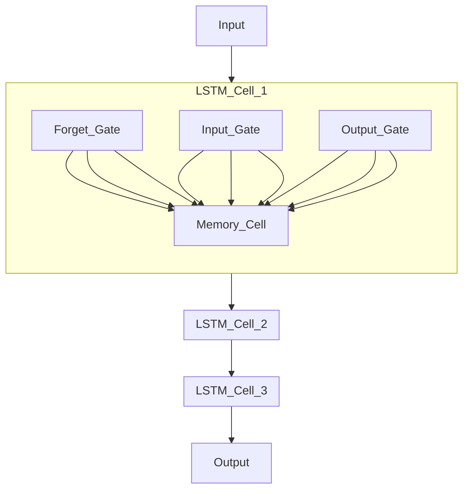

# Modeling

## Abstract
_[explain in general how financial cryptocurrency market work, specificities overs financial market as stock exchange. Focus on Bitcoin in particulary. Explain how prediction is important for financial strategy of profitability. Explain technics of timeseries prediction such MSE, MAE, MAPE... and the benefit of using deepl learning model such LTSM and list benefit and limitation of LTSM ]_

The financial cryptocurrency market, similar to traditional stock exchanges, operates through the buying and selling of digital assets. 

Unlike stock exchanges where assets are shares in companies, cryptocurrencies are digital tokens that utilize blockchain technology. 

Bitcoin, the first and most well-known cryptocurrency, has unique characteristics such as high volatility and 24/7 trading availability. 

Predicting Bitcoin prices is crucial for financial strategy and profitability as it helps investors make informed decisions. 
Time-series prediction techniques such as Mean Squared Error (MSE), Mean Absolute Error (MAE), and Mean Absolute Percentage Error (MAPE) are often used to evaluate model accuracy but Deep learning models like Long Short-Term Memory (LSTM) are particularly beneficial for their ability to capture long-term dependencies in time-series data. 

## Methodology

_[resume standard methodology that we apply]_
Our standard methodology involves several key steps: 

data collection and preprocessing, 
model training, evaluation, and 
deployment. 

We use Airflow to automate data collection from sources like Kaggle and Yahoo Finance. The data is then preprocessed, normalized, and split into training and test sets. An LSTM model is developed, trained, and evaluated using MLflow for tracking and versioning. 
The final model is deployed via FastAPI, with Prometheus and Kibana for monitoring and logging. Streamlit is used to create a user-friendly dashboard for visualizing predictions.

## Flow and sequencing overview

### Data collection and preprocessing

#### Data provider

_[Explain the crypto price mecanism, how data can be formatted through generic format as OHCL standard. Explain with python code, how these data can be retriev with Kaggle or yahoo finance]_

The mechanism of cryptocurrency pricing is driven by market demand and supply dynamics, influenced by factors such as market sentiment, economic news, and regulatory developments. Data can be formatted using the Open-High-Low-Close (OHLC) standard, which captures key price points for each time interval. Below is an example of how to retrieve data using Python from Kaggle:

```python
print('hello world')


```

#### Data preparation

- input data : The raw data collected is formatted into a standardized structure.
- reshape : Data is reshaped to fit the model input requirements.

##### Adjustement

_[Explain the necessity to download full history for each pair add with hourly automated data retreival]_
Downloading the full historical data for each cryptocurrency pair is essential to capture all relevant patterns. Hourly automated data retrieval ensures the dataset is up-to-date and comprehensive.

##### Data normalization

Data normalization is performed to ensure that all features contribute equally to the model training process. Techniques like Min-Max scaling are commonly used.

#### Train-Test Data Split 

Data is split into training and test sets to evaluate model performance. Typically, 70-80% of the data is used for training, and the remaining 20-30% is used for testing.

#### Modele Training 

##### MLFlow

_[explain what is mlflow, its history, usage, the benefit and limitation. Explain the general mecanism of mlflow from training to deployment]_

MLflow is an open-source platform for managing the end-to-end machine learning lifecycle. It was developed by Databricks to address the complexities of model tracking, versioning, and deployment. MLflow's benefits include simplified experiment tracking and reproducibility, although it may have limitations such as requiring additional setup and integration effort.

MLflow works by logging metrics, parameters, and artifacts during training. These logs can then be used to compare different runs and select the best model for deployment.

#### LTSM

_[explain in detail how LTSM work in detail, eventually include latex formula with explaination]_
Long Short-Term Memory (LSTM) networks are a type of recurrent neural network (RNN) designed to capture long-term dependencies in sequential data. LSTMs use memory cells to maintain information over time, which helps in learning time-series patterns more effectively. 

Below is a LaTeX representation of an LSTM cell:


##### LSTM Model Architecture
_[explain with mermaid diagram the whole LTSM architecture in detail with explaination]_

this graph must be 're modeling' ! 


The architecture consists of multiple LSTM cells that process input sequentially, allowing the model to learn temporal dependencies.

## Results and Discussion
[leave empty for now : see frederic ]

## Conclusion
[leave empty for now : see frederic]

## tesaurus

_[list all terms used related to MLFLOW, LTSM, RNN ...with description. See frederic for more terms to explain]_

* **MLflow**: A platform for managing the end-to-end machine learning lifecycle.
* **LSTM**: Long Short-Term Memory, a type of recurrent neural network.
* **RNN**: Recurrent Neural Network, a class of neural networks for processing sequential data.
* **OHLC**: Open-High-Low-Close, a format for financial data.
* **MSE**: Mean Squared Error, a metric for evaluating model performance.
* **MAE**: Mean Absolute Error, a metric for evaluating model performance.
* **MAPE**: Mean Absolute Percentage Error, a metric for evaluating model performance.
* **FastAPI**: A web framework for building APIs with Python.
* **Prometheus**: An open-source monitoring and alerting toolkit.
* **Kibana**: An open-source analytics and visualization platform.
* **Streamlit**: An open-source app framework for Machine Learning and Data Science teams.

## References 

_[list related LTSM currency prediction usages, science paper, tests. And read/resume them !!]_


1. Liu S, Liao G, Ding Y. Stock Transaction Prediction Modeling and Analysis Based on LSTM. In
Proceedings of the 2018 13th IEEE Conference on Industrial Electronics and Applications (ICIEA), Wuhan,
China, 18–22 August 2018.
2. Borovkova S, Tsiamas I. An Ensemble of LSTM Neural Networks for High ‐ Frequency Stock Market
Classification. Journal of Forecasting 2019; 38(6): 600–619.
3. Baek Y, Kim HY. ModAugNet: A New Forecasting Framework for Stock Market Index Value With an
Overfitting Prevention LSTM Module and a Prediction LSTM Module. Expert Systems with Applications
2018; 113: 457–480
4. Eapen J, Bein D, Verma A. Novel Deep Learning Model With CNN and Bi-Directional LSTM for Improved
Stock Market Index Prediction. In Proceedings of the 2019 IEEE 9th Annual Computing and
Communication Workshop and Conference (CCWC), Las Vegas, NV, USA, 7–9 January 2019.
5. Selvin S, Vinayakumar R, Gopalakrishnan EA, Menon VK, Soman KP. Stock Price Prediction Using
LSTM, RNN and CNN-Sliding Window Model. In Proceedings of the 2017 International Conference on
Advances in Computing, Communications and Informatics (ICACCI), Udupi, India, 13–16 September 2017.
6. Nelson DM, Pereira AC, de Oliveira RA. Stock Market’S Price Movement Prediction With LSTM Neural
Networks. In Proceedings of the 2017 International Joint Conference on Neural Networks (IJCNN),
Anchorage, AK, USA, 14–19 May 2017.
7. Sherstinsky A. Fundamentals of Recurrent Neural Network (RNN) and Long Short-Term Memory (LSTM)
Network. Physica D: Nonlinear Phenomena 2020; 404: 132306.
8. Nabipour M, Nayyeri P, Jabani H, Mosavi A, Salwana E, Shahab S. Deep Learning for Stock Market
Prediction. Entropy 2020; 22(8): 840.
9. Bhandari HN, Rimal B, Pokhrel NR, Rimal R, Dahal KR, Khatri RKC. Predicting Stock Market Index
Using LSTM. Machine Learning with Applications 2020; 9: 100320.
10. Althelaya KA, El-Alfy E-SM, Mohammed S. Evaluation of Bidirectional LSTM for Short-and Long-Term
Stock Market Prediction. In Proceedings of the 2018 9th International Conference on Information and Communication Systems (ICICS), Irbid, Jordan, 3–5 April 2018
11. Moghar A, Hamiche M. Stock Market Prediction Using LSTM Recurrent Neural Network. Procedia
Computer Science 2020; 170: 1168–1173.