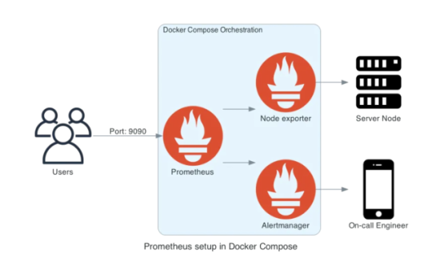
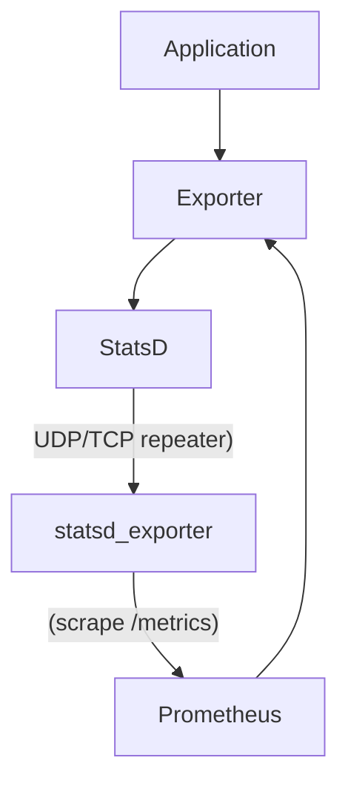

# Monitoring and Alerting Services

## Monitoring Services

**Monitoring system is composed of several services** :

### Prometheus :

Prometheus is an open-source monitoring and alerting tool, commonly used for time-series data reporting. It is particularly convenient when using Grafana as a reporting UI since Prometheus is a supported datasource.
Service is available on browser port 9090.

Prometheus is connected to services (Prediction and Gateway APIs, Airflow, node-explorer, AlertManager) to retrieve metrics. Service is available on browser port 9090.
It is configured using the prometheus.yml file, which is set up to scrape logs from those different services :

Classical scheme is the following :

We will use another classical approah using **Stats_exporter**.
The StatsD exporter is a drop-in replacement for StatsD, used to collect various metrics and convert them to Prometheus format automaticly via configured mapping rules.
tatsD's repeater backend is configured to repeat all received metrics to a statsd_exporter process.

For example, Airflow emits metrics in the StatsD format automatically if certain environment variables (starting with AIRFLOW__SCHEDULER__STATSD_) are set.
New schemes arethe following :

For example, Airflow emits metrics in the StatsD format automatically if certain environment variables (starting with AIRFLOW__SCHEDULER__STATSD_) are set.

### Node-exporter:

Node Exporter is a tool designed to collect and expose various system-level metrics from a target (node or machine). 
It runs as a service on the node and provides valuable insights into CPU usage, memory consumption, disk usage, network statistics, and other crucial system-level data. 
Node Exporter allows Prometheus to scrape these metrics using the pull model and store them as time-series data. Native service is available on browser port 9100.

### Grafana
Grafana is an open-source reporting UI layer that is often used to connect to non-relational database.It used for the graphical interface of logs and alerts, when  connected to Prometheus to retrieve metrics.
Grafana allow to create dashboards and alerts that can act on data from any of our supported data sources.
It also contain its own Alertmanager system.
Service is available on browser port 30020.

#### Dashboard
It allows different metrics to be displayed as dashboards, making it easier to understand and analyze data.
We have used the Node Exporter Full dashboard (dashboard’s ID: 1860) to make Dashboard of Prometheus job (Node explorer and Airflow ann API)
There are many  useful StatsD metrics made available by Airflow, such as Queued task, Runnings tasks, DAG and task duration. 

#### Alertmanager
Grafana also contain its own Alertmanager system, which will be used to superside Alertmanager. In this case, Alertamanager

## Alerting Services

### Alertmanager
Alertmanager is responsible for managing and handling alerts generated by Prometheus based on predefined alerting rules. Alertmanager handles deduplication, grouping, and routing of alerts to different alert notification channels such as email.
The monitoring container will send the alert and, if necessary, call Airflow for automatic retraining. This ensures that the prediction model remains performant and up-to-date. 
For our project, we decided to establish a manualre training when receiving
Native Service is available on browser port 9093.

It is realized directly trought configuration files :
    -monitoting_rules.yml file will be responsible for configuring alerts using PromQL.
    -alertmanager.yml configuration file facilitates the setup and configuration of alerts.

### Grafana Alertmanager

Grafana have its own AlerManager with an UI interface, selecting metrics and conditions.
It is also possible to use a configuration file, which configure alert rules and contacts point, what we have done.
Alerting system have be done through email and Slack canal. TO MODIFY AND FINALIZE