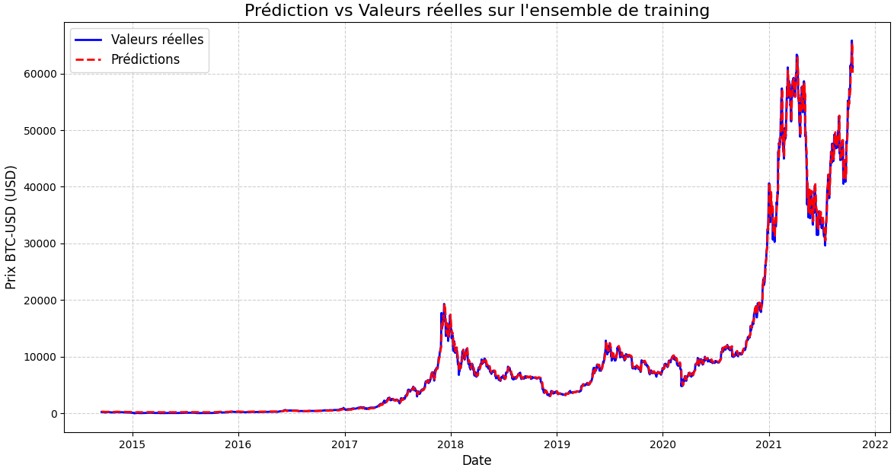
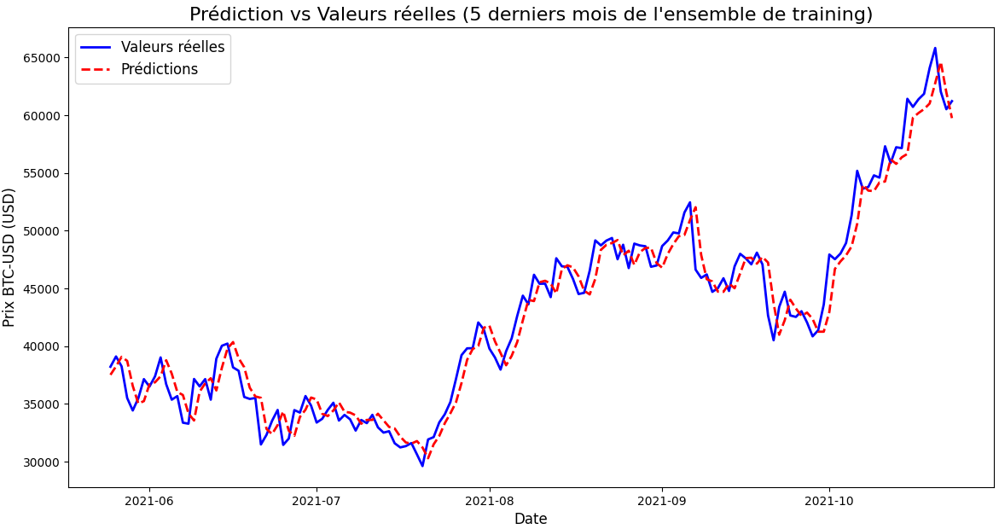
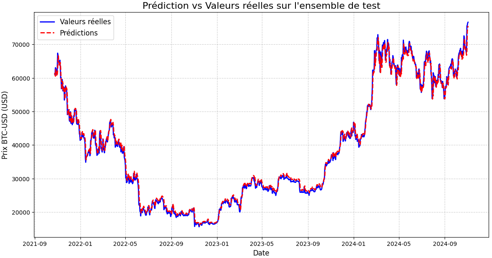
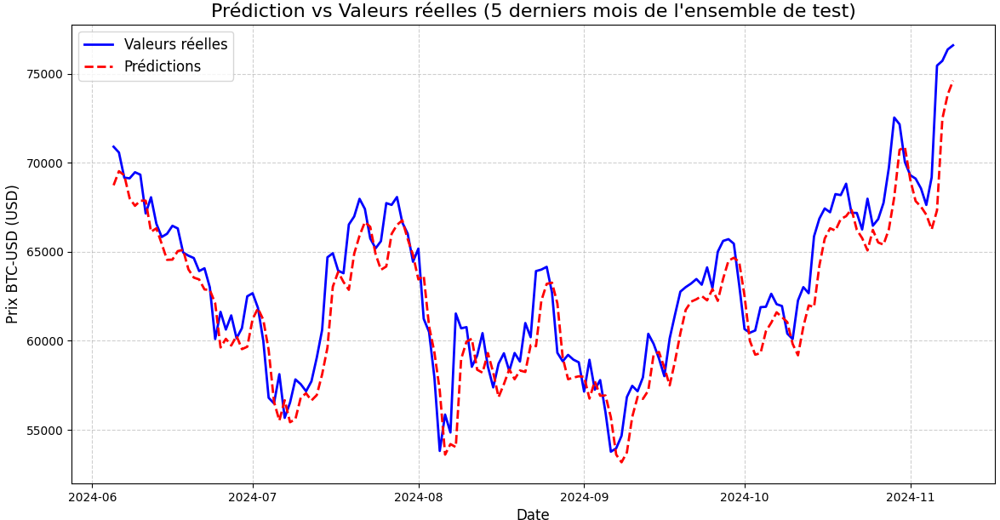

# Modelling results and Discussion

## Modelling results

The following curves allow to compare crypto price predicted by the model and real prices, for both training dataset et testing dataset.

It have been done using the following parameters:
- neurons = 300 ie Architecture of LSTM model contains 300 neurons, which is an optimze number.
- pas_temps = 7 which means that 7 days have been used to predict the next day price. This duration offer good prediction but valeus greater that 7 can give better results.
- batch_size = 5, which refers to the number of training samples that are processed together in one forward and backward pass through the model before the model's weights are updated.  It plays a crucial role in how the model learns and generalizes from the data.

### Training dataset

First, the results in the whole training dataset :

Then results in the training dataset limited to the last 5 months :

We can observe that curves are very close. We now have to cheack on testing dataset if thete is not Overfitting.

Overfitting may occurs when a model learns not only the underlying patterns in the training data but also the noise and random fluctuations. As a result, the model performs well on the training data but poorly on new, unseen data.

### Testing dataset

Second, the results in the whole training dataset :

Then results in the testing dataset limited to the last 5 months :

We can observe that curves are not as close as for the training, and that the model have a good generalization capability without showwin Overfitting

## Discussion*

Modelling results are satisfactory on a short term approach even using only past bitcoin prices, for the Bitcoin cryptocurrency

Model has been volontary keep simple due to the fact that it was not the main purpose of the projet.

As this project may continue, we integrated in Airflow the possibility to add another assets and update them regularly according to the data frequency

The automation in GitHub Action and Airflow, as well as for the alerting, has significantly reduced manual interventions and represents a substantial time saving. This highlights the effectiveness of a process or system in automating tasks and improving efficiency.

